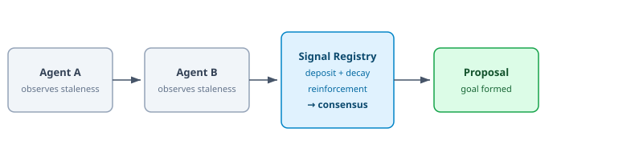
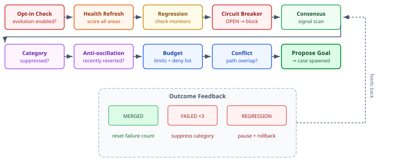
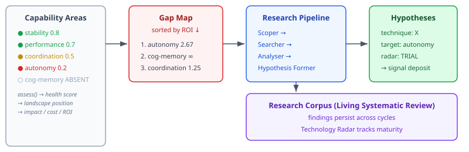

# The Hive That Improves Itself

Ants don't have managers. No central planner assigns them to trails. An ant drops a pheromone, another ant follows it, the trail strengthens through reinforcement, and a colony-level intelligence emerges from agents that never directly communicate. The pattern is called stigmergy — indirect coordination through the shared environment — and it turns out to be a surprisingly practical foundation for software agent coordination.

Over the past week I've built a complete stigmergy-to-evolution stack in CaseHub's engine: eleven issues, from environment observation through swarm execution to a continuous self-improvement loop with regression detection, circuit breakers, and a structured research pipeline. The system can bootstrap from nothing, grow its own capabilities, detect when its improvements make things worse, and roll them back — all with a human operator watching every decision through a command centre.

This isn't theoretical. It compiles, it has 296 passing tests, and every safety gate is exercised.

## From Pheromones to Proposals

The foundation is signals. CaseHub agents deposit pheromone-like signals into a shared `SignalRegistry` — temporal values that decay naturally and strengthen through reinforcement from multiple agents. When enough agents independently notice the same thing (a stale dependency, a lint violation, a coverage gap), the signals reach consensus, and the system proposes an improvement.



The key insight: no agent proposes an improvement directly. Agents observe. They deposit signals about what they notice. The system aggregates those observations and proposes improvements only when independent agents converge on the same conclusion. This is fundamentally different from a central quality scanner — the detection is distributed, the consensus is emergent, and false positives get filtered by requiring multiple independent observations.

## The Gate Pipeline

A proposal reaching consensus is necessary but not sufficient. Between detection and action sits a pipeline of safety gates — each gate can block the proposal, and each exists because of a specific failure mode we wanted to prevent.



`EvolutionTicker` owns this pipeline. Every invocation path — event-driven or timer — passes through the same gates. There is no shortcut that bypasses the circuit breaker or the conflict detector. This is enforced by architecture, not convention.

## The Safety Stack

The interesting part isn't the individual gates — circuit breakers and budget limits are well-understood patterns. The interesting part is how they compose to handle the specific risks of autonomous self-improvement.

**Data autophagy** is the central risk. A system that improves itself can degrade itself just as easily — one bad improvement lands, health drops slightly, the next improvement compensates by over-optimising in a different direction, and the system spirals into incoherence while every individual change looked reasonable. The `HealthScoreTracker` aggregates health across capability areas with configurable weights, and the `ImprovementCircuitBreaker` trips OPEN when the aggregate score drops below threshold or when the health delta turns sharply negative. Once OPEN, no improvements are proposed until sustained recovery is observed.

**Regression detection** handles the single-improvement case. When an improvement merges, `RegressionDetector` captures the current health snapshot as a baseline and monitors the system for a configurable window. If health degrades, a `ConfidenceScorer` evaluates how likely it is that this specific improvement caused the regression — checking whether the degradation correlates with the modified areas, whether other improvements merged in the same window (which reduces confidence), and whether the regression appears in areas unrelated to the change (which also reduces confidence). High confidence triggers an automatic rollback case. Medium confidence pauses the category. Low confidence emits a signal for the next tick to consider.

The confidence scoring is composable:

```java
double confidence = 0.0;
if (regressionWithinWindow(before, after))  confidence += 0.2;
if (multipleAreasDegraded(before, after))   confidence += 0.1;
// Each signal adds or subtracts — clamped to [0, 1]
```

Simple additive weights. No ML, no black box. A developer reading the code can predict exactly what the scorer will do for any given health state.

**Anti-oscillation** prevents the improve-revert-re-propose cycle. `RollbackHistory` tracks what was recently rolled back. `ImprovementGoalFormationStrategy` checks this history before proposing — if the same category and target were reverted within the regression window, the proposal is suppressed. The system won't keep trying the same thing that already failed.

**Conflict avoidance** serialises improvements that would touch overlapping files. Two dependency updates in the same module are serialised. A small lint fix (under the trivial threshold) can run concurrently with a large refactor in the same directory — it's exempt from directory-level conflict detection, only blocked by exact file overlap. This prevents merge conflicts that LLMs handle poorly.

## Growing from Nothing

The system doesn't need pre-programmed categories to start. The capability taxonomy is built around an SPI — `CapabilityArea` — with ten bootstrap areas covering stability, performance, execution, coordination, perception, autonomy, cognitive reasoning, cognitive memory, safety, and integration. Each area provides an `assess()` method that returns a health score and a landscape position: AHEAD, AT_PARITY, BEHIND, or ABSENT.



A `GapMap` computes ROI-ranked gaps from these assessments. ABSENT and BEHIND areas surface as the highest-priority gaps. The research pipeline — four SPIs following the PRISMA protocol methodology — investigates those gaps and produces improvement hypotheses. Those hypotheses are deposited as signals, entering the same consensus-based proposal path as every other improvement.

The practical consequence: you can point this system at an empty codebase with a briefing document, and the evolution loop will bootstrap from there. The briefing seeds the capability areas. Research discovers what "good" looks like. Hypotheses become proposals. The loop runs. No pre-programmed improvement scripts required.

## The Conductor, Not the Autopilot

The system can run autonomously. That's the capability. But the design intent is a command centre where a developer acts as conductor — watching every gate decision, every health score shift, every regression detection, and intervening at any point.

Every state transition emits an event: `CIRCUIT_BREAKER_TRIPPED`, `REGRESSION_DETECTED`, `IMPROVEMENT_CONFLICT_DETECTED`, `CAPABILITY_AREA_CHANGED`. The `ImprovementCategoryTracker` supports manual `pauseCategory` and `unpauseCategory`. The circuit breaker has `manualReset`. The budget enforcer has a structural deny list — safety-critical components like `EvolutionTicker`, `RegressionDetector`, and `ImprovementCircuitBreaker` cannot modify themselves. The improvement system cannot undermine its own safety constraints.

This is what makes the system practical rather than theoretical. Autonomous capability gives you the option to step back. Observable, interruptible execution gives you the confidence to actually do it. The conductor decides when to let the orchestra play and when to stop the music.

## What the Architecture Looks Like

Eleven issues. Sixty-two new files. Three modules touched (api, runtime-core, runtime). The layering is deliberate:

- **api module**: all SPIs and records — `CapabilityArea`, `ResearchCorpus`, `RollbackPolicy`, `HealthPolicy`, the research pipeline interfaces. Pure contracts, no behaviour.
- **runtime-core**: all implementations — `EvolutionTicker`, `ImprovementCircuitBreaker`, `RegressionDetector`, `ConflictDetector`, `HealthScoreTracker`, `ImprovementCategoryTracker`, `ResearchPipelineOrchestrator`, default SPI implementations.
- **runtime**: the rollback case template YAML — a shortened improvement lifecycle (confirm regression → revert → submit PR → fast-track review → integrate → record outcome).

Everything in runtime-core uses direct instantiation in tests — no Quarkus container, no CDI magic, no Testcontainers. The integration test creates the full pipeline by hand, wires the components together, and exercises the loop end-to-end. A test that needs a container to verify business logic is a test that's testing the wrong thing.

## What Comes Next

The engine provides the pipeline, the contracts, and rule-based defaults. The intelligence comes from three future layers:

The cognitive agent (blocks) wires `EvolutionTicker` into `CognitionCore` for personality-modulated improvement priorities — a curious agent researches more aggressively, a cautious one raises the circuit breaker threshold.

The research loop (blocks) provides LLM-powered implementations of the four research SPIs — real literature search, structured analysis using PRISMA protocol, and hypothesis formation that goes beyond pattern matching.

The cognitive memory (neocortex) replaces `InMemoryResearchCorpus` with a persistent store backed by the knowledge graph, where improvement outcomes become episodic memory and capability assessments inform long-term strategy.

The infrastructure is ready for all three. The SPIs are defined, the default implementations work, and the safety gates are tested. The next session can plug in the intelligence without redesigning the plumbing.
